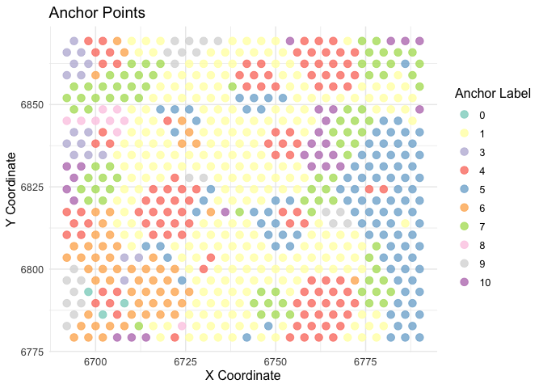
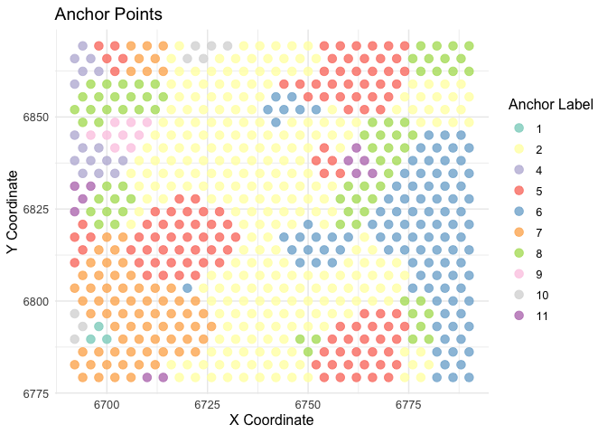
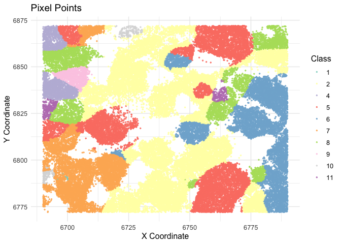

<!-- README.md is generated from README.Rmd. Please edit that file -->

# fictureR

# fictureR: FICTURE from Si et al. 2023 in R

`fictureR` is an R implementation of the **FICTURE** method, designed to
efficiently handle high-resolution spatial transcriptomics (ST) data.
This package focuses on **variational Expectation-Maximization (EM)
steps** and attempts to perform **Latent Dirichlet Allocation (LDA)
training** for analyzing complex, segmentation-free ST datasets at
submicron resolution.

## Purpose

Spatial transcriptomics (ST) data allow for transcriptome-wide gene
expression analysis with high spatial precision, often at submicron
resolution. Traditional methods rely on cell segmentation or gridding,
which often fail in tissues with irregular and diverse cell sizes and
shapes. **FICTURE** bypasses these issues with a **segmentation-free
spatial factorization** approach that efficiently scales to large
datasets, including those with billions of spatial coordinates.

The R implementation focuses on: - Performing the **variational EM
step**, crucial for spatial factorization. - Attempting **LDA training**
to model the spatial distribution of gene expression in tissues.

The package is ideal for users working with both sequencing- and
imaging-based ST data and is compatible with large-scale,
high-resolution studies

## Installation

You can install the development version of fictureR from Github with:

``` r
# install.packages("devtools")
devtools::install_github("walterwilliamson/fictureR")
```

## Example

Here we show the basic usage of the `slda_decoder` and `visualizer`
functions, using an example dataset of mouse liver gene expression from
\[Vizgen MERFISH\]:(<https://info.vizgen.com/mouse-liver-access>)

Due to the large size of the dataset and slow nature of our function, we
have used a subset of the data for demonstration purposes.

``` r
library(fictureR)
#> Warning: replacing previous import 'dplyr::count' by 'matrixStats::count' when
#> loading 'fictureR'
library(dplyr)
#> 
#> Attaching package: 'dplyr'
#> The following objects are masked from 'package:stats':
#> 
#>     filter, lag
#> The following objects are masked from 'package:base':
#> 
#>     intersect, setdiff, setequal, union
mouse_anchors <- fictureR::mouse_anchors
mouse_transcripts <- fictureR::mouse_transcripts

# Visualization of anchors before variational EM, subsetting to a small region
visualizer(mouse_anchors %>% filter(x >= 6690.1, x <= 6790.1,
                                    y >= 6772, y <= 6872), 
           type = c("anchor"))
#> Warning in RColorBrewer::brewer.pal(n, pal): n too large, allowed maximum for palette Set2 is 8
#> Returning the palette you asked for with that many colors
#> Warning: Removed 48 rows containing missing values or values outside the scale range
#> (`geom_point()`).
```



``` r

# Decoding input data
# mouse_output <- slda_decoder(mouse_transcripts, mouse_anchors, scale = 100)


# Updated anchor assignments following decoding
visualizer(fictureR::mouse_updated_anchor, type = c("anchor"))
#> Warning in RColorBrewer::brewer.pal(n, pal): n too large, allowed maximum for palette Set2 is 8
#> Returning the palette you asked for with that many colors
#> Warning: Removed 19 rows containing missing values or values outside the scale range
#> (`geom_point()`).
```



``` r
# 
# Visualization of pixel data following decoding
visualizer(fictureR::mouse_pixel, type = c("pixel"))
#> Warning in RColorBrewer::brewer.pal(n, pal): n too large, allowed maximum for palette Set2 is 8
#> Returning the palette you asked for with that many colors
#> Warning: Removed 757 rows containing missing values or values outside the scale range
#> (`geom_point()`).
```


